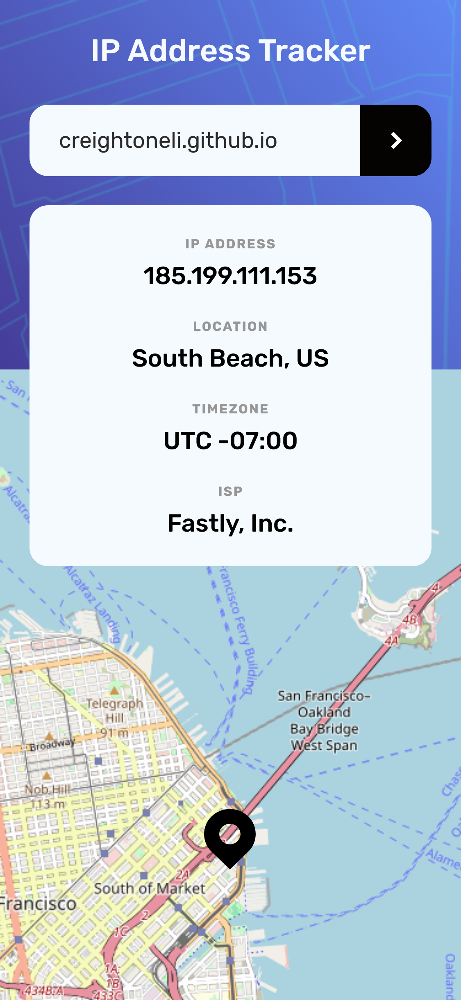
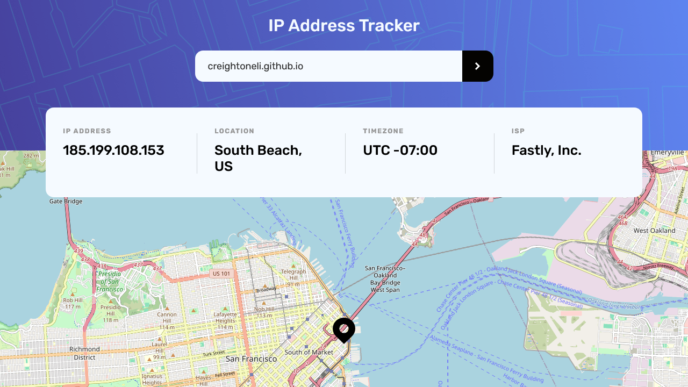

# Frontend Mentor - IP address tracker solution

This is a solution to the [IP address tracker challenge on Frontend Mentor](https://www.frontendmentor.io/challenges/ip-address-tracker-I8-0yYAH0).

## Table of contents

- [Overview](#overview)
  - [The challenge](#the-challenge)
  - [Screenshots](#screenshots)
  - [Links](#links)
- [My process](#my-process)
  - [Built with](#built-with)
  - [Continued development](#continued-development)
  - [Useful resources](#useful-resources)
- [Author](#author)

## Overview

### The challenge

Users should be able to:

- [x] View the optimal layout for each page depending on their device's screen size
- [x] See hover states for all interactive elements on the page
- [x] See their own IP address on the map on the initial page load
- [x] Search for any IP addresses or domains and see the key information and location

### Screenshots

### Links

- Solution URL: [Add solution URL here](https://creightoneli.github.io/)
- Live Site URL: [https://creightoneli.github.io/ip-tracker](https://creightoneli.github.io/ip-tracker)

## My process

### Built with

- Semantic HTML5 markup
- CSS custom properties
- Flexbox
- Mobile-first workflow
- [IP Geolocation API](https://geo.ipify.org)
- [Leaflet](https://leafletjs.com/) - JavaScript library for interactive maps

### Continued development

I would like to continue working on this. Maybe customize it some more to display additional information. I think once the IP Geolocaiton API runs out of free requests I'll simply move over to another API. One that doesn't require an API key maybe, I do already have one in mind. That'll be in the future of course and shouldn't be a big deal to change. 

### Useful resources

- [IP Geolocation API Docs](https://geo.ipify.org/docs) - Very helpful for quickly getting started requesting JSON.
- [Leaflet Quick Start Guide](https://leafletjs.com/examples/quick-start/) - A great resouce for initial setup for the leaflet map. You can also easily get to the docs from there for all the information you could ever possibly need regarding Leaflet.
- [1.5 Mapping Geolocation with Leaflet.js - Working with Data and APIs in JavaScript](https://www.youtube.com/watch?v=nZaZ2dB6pow) by [The Coding Train](https://www.youtube.com/@TheCodingTrain) on Youtube. This video really helped me to better understand the Leaflet API and how to work with it. It was a bit of a challenge trying to understand the documentation alone, but with the help of this video I determined how to set it all up properly.

## Author

- Website - [creightoneli.github.io](https://creightoneli.github.io/)
- Frontend Mentor - [@CreightonEli](https://www.frontendmentor.io/profile/CreightonEli)
- Twitter - [@creightone_dev](https://x.com/creightone_dev)
- Instagram - [creightone.dev](https://www.instagram.com/creightone.dev/)